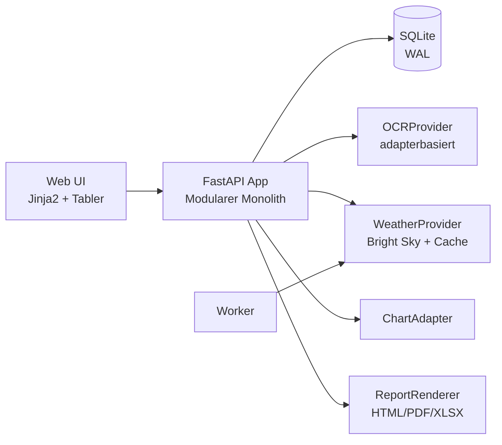

<div align="center">

# ⚡ meterweb

**Self-hosted Plattform für Zählerstände, Verbräuche, Kosten und wetterbezogene Auswertungen.**

[](https://www.python.org/)
[](https://fastapi.tiangolo.com/)
[](https://docs.docker.com/compose/)
[](https://www.sqlite.org/)
[](#lizenz)

</div>

---

## ✅ Aktueller Plattformstand

meterweb ist aktuell ein **modularer Python-Monolith** mit:

- serverseitigem Web-UI (FastAPI + Jinja2 + Tabler)
- Single-Tenant-/Single-User-Login
- Docker-Compose-Betrieb mit `web`- und `worker`-Service
- SQLite (WAL) als primärer Datenbank
- API- und Web-Flows für Gebäude/Einheiten/Messpunkte, Ablesungen, OCR, Wetter, Analytics und Exporte

> Der Fokus dieser README liegt auf dem **heute implementierten Stand** im Repository.

---

## 🧱 Architektur auf einen Blick



**Leitprinzipien:**
- Trennung in Domain, Application, Infrastructure, Interfaces
- Externe Integrationen über Ports/Adapter
- Serverseitiges Rendering statt schwerer SPA

---

## 🚀 Schnellstart (Docker Compose)

### 1) Repository vorbereiten

```bash
git clone <dein-repo-url>
cd meterweb
cp .env.example .env
```

### 2) Pflichtwerte in `.env` setzen

```dotenv
SECRET_KEY=<starker-key-mit-mindestens-32-zeichen>
ADMIN_USERNAME=<kein-standardwert-wie-admin>
ADMIN_PASSWORD=<starkes-passwort-mindestens-12-zeichen>
```

### 3) Starten

```bash
docker compose up --build
```

Danach ist die App unter **http://localhost:8000** erreichbar.

---

## 🧩 Funktionsumfang (implementiert)

### Web-UI

- Login (`/login`) und Session-basierte Authentifizierung
- Dashboard (`/dashboard`) mit Listen/Erfassung für:
  - Gebäude
  - Einheiten
  - Messpunkte
  - manuelle Ablesungen
  - Foto-Ablesungen mit OCR-Bestätigungsansicht
- Reports/Exporte pro Messpunkt:
  - Monatsbericht (HTML)
  - CSV/XLSX/PDF

### API (`/api/v1`)

- **Stammdaten**
  - `GET/POST /buildings`
  - `GET/POST /units`
  - `GET/POST /meter-points`
- **Ablesungen**
  - `POST /readings`
  - `POST /readings/{reading_id}/confirm`
  - `POST /readings/{reading_id}/correct`
  - `GET /meter-points/{meter_point_id}/current-register`
- **OCR**
  - `POST /ocr/run`
  - `POST /ocr/readings`
  - `POST /ocr/{reading_id}/accept`
  - `POST /ocr/{reading_id}/reject`
- **Wetter**
  - `GET/POST /weather/buildings/{building_id}/station`
  - `POST /weather/buildings/{building_id}/station/auto`
  - `POST /weather/buildings/{building_id}/station/manual`
  - `GET/POST /weather/buildings/{building_id}/series`
  - `POST /weather/buildings/{building_id}/sync`
- **Analytics**
  - `GET /analytics/{meter_point_id}`
  - `GET /analytics/register/{meter_register_id}`
  - `GET /analytics/building/{building_id}`
  - `POST /analytics/compute/absolute|pulse|interval`
- **Reports/Export/Jobs**
  - `POST /reports/monthly`
  - `POST /reports/export/csv|xlsx|pdf`
  - `POST /jobs/weather-sync/{building_id}`
  - `POST /jobs/analytics/recompute/{meter_point_id}`

---

## ⚙️ Konfiguration

Wichtige Umgebungsvariablen:

- `SECRET_KEY`
- `ADMIN_USERNAME`
- `ADMIN_PASSWORD`
- `DATABASE_URL` (Default: `sqlite:////data/meterweb.db`)
- `WEATHER_PROVIDER` (Default: `brightsky`)
- `WEATHER_BASE_URL` (Default: `https://api.brightsky.dev`)
- `DEFAULT_LOCALE` (z. B. `de-DE`)
- `DEFAULT_TIMEZONE` (z. B. `Europe/Berlin`)
- `UPLOADS_DIR` (Default: `/uploads`)

Persistente Volumes (Compose):

- `app_data` (SQLite)
- `uploads` (Bilder/OCR)
- `reports` (Ausgaben)
- `backups` (Sicherungen)

---

## 📦 Optionale Feature-Gruppen

Python-Extras im Backend:

- `ocr`: OpenCV + Tesseract-Python + Pillow
- `reports`: WeasyPrint + openpyxl
- `dev`: Tests/Entwicklung

Beispiel lokal:

```bash
cd backend
pip install -e .[dev]
pip install -e .[ocr,reports]
```

Feature-Status ist abrufbar über:

- `GET /health/features`

---

## 🧪 Lokale Entwicklung (ohne Docker)

```bash
cd backend
python -m venv .venv
source .venv/bin/activate
pip install -e .[dev]
export SESSION_HTTPS_ONLY=false
uvicorn meterweb.main:app --reload
```

Hinweis: Für lokale HTTP-Tests muss `SESSION_HTTPS_ONLY=false` gesetzt werden, damit der Session-Cookie ohne TLS funktioniert.

---

## 🔐 Sicherheit & Betrieb

- Nutze in Produktion HTTPS/TLS
- Lege `SECRET_KEY` und Admin-Credentials niemals ins Repository
- Sichere regelmäßig `app_data`, `uploads`, `reports` und `backups`
- Teste Restore-Prozesse regelmäßig

---

## 🗂️ Projektstruktur

```text
.
├── backend/
│   ├── meterweb/
│   │   ├── domain/
│   │   ├── application/
│   │   ├── infrastructure/
│   │   ├── interfaces/http/
│   │   └── templates/
│   └── tests/
├── docker-compose.yml
├── Dockerfile
└── .env.example
```

---

## 🤝 Mitwirken

Beiträge sind willkommen. Für größere Änderungen bitte zuerst ein Issue eröffnen, damit Scope und Architektur abgestimmt werden können.

---

## 📄 Lizenz

Das Projekt ist als Open-Source-Software konzipiert. Eine verbindliche Lizenz sollte als `LICENSE` im Repository gepflegt werden (empfohlen: AGPL-3.0-or-later oder Apache-2.0).
