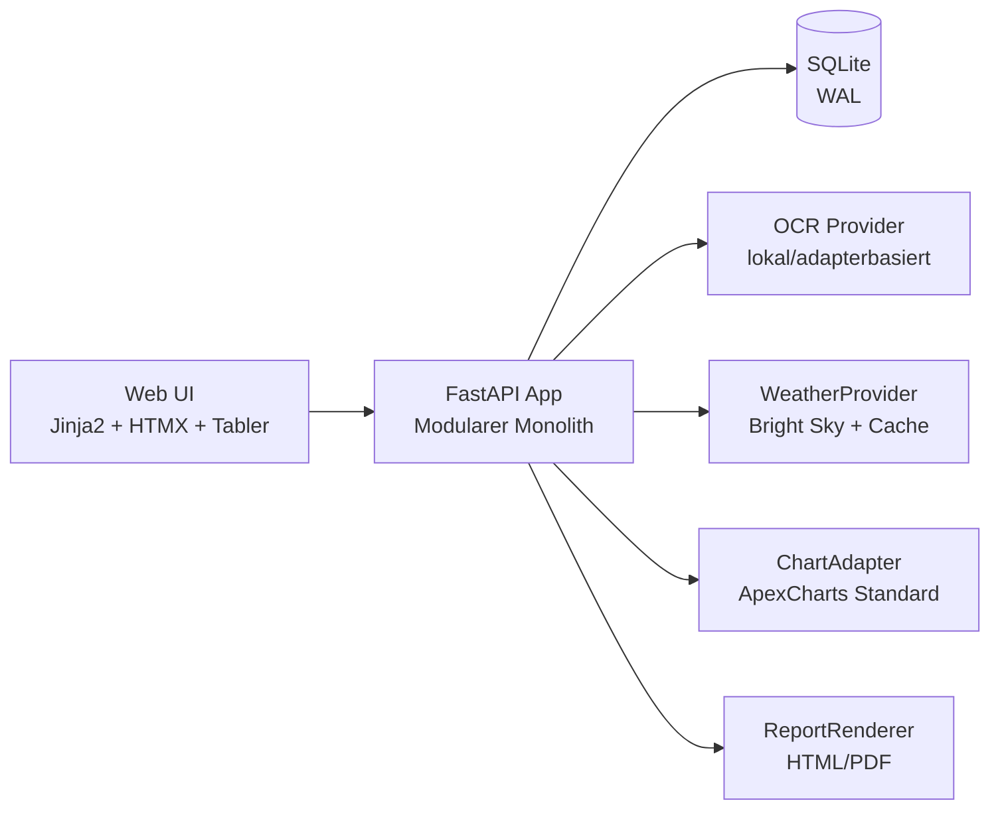

<div align="center">

# ⚡ meterweb

**Self-hosted Plattform für Zählerstände, Verbräuche, Kosten und witterungsbereinigte Auswertungen.**

[](https://www.python.org/)
[](https://fastapi.tiangolo.com/)
[](https://docs.docker.com/compose/)
[](https://www.sqlite.org/)
[](#lizenz)

</div>

---

## ✨ Warum meterweb?

meterweb ist für Betreiber gedacht, die **Energie- und Medienverbräuche** transparent erfassen und auswerten wollen – ohne Cloud-Zwang.

- 🧾 **Erfassen**: manuelle Zählerstände + foto-/OCR-gestützte Erkennung
- 📈 **Analysieren**: Verbrauch, Kosten, Trends, Lastgänge, Vergleiche
- 🌦️ **Einordnen**: witterungsbereinigte Sicht mit Bright Sky Daten
- 🐳 **Betreiben**: Docker-Compose, Single-Tenant, self-hosted
- 🌍 **Lokalisieren**: Deutsch/Englisch, korrekte Zahlen- und Datumsformate

---

## 🧱 Architektur auf einen Blick



**Leitprinzipien:**
- Klare Trennung von Domain, Application, Infrastructure, Interfaces
- Externe Integrationen nur über Adapter-Interfaces
- Serverseitiges Rendering mit schlanker Interaktivität (kein schweres SPA)

---

## 🚀 Schnellstart (Docker Compose)

### 1) Repository vorbereiten

```bash
git clone <dein-repo-url>
cd meterweb
cp .env.example .env
```

### 2) Sichere Zugangsdaten setzen

Passe in `.env` mindestens diese Werte an (identisch zur Runtime-Validierung):

```dotenv
# mindestens 32 Zeichen + Klein-/Großbuchstabe + Zahl + Sonderzeichen
SECRET_KEY=<dein-starker-secret-key>

# mindestens 3 Zeichen, kein Standardwert wie "admin"
ADMIN_USERNAME=<dein-admin-user>

# mindestens 12 Zeichen + Klein-/Großbuchstabe + Zahl + Sonderzeichen
ADMIN_PASSWORD=<dein-starkes-admin-passwort>
```

> [!IMPORTANT]
> Die Werte in `.env.example` sind bewusst ungültige Marker. Ohne Ersetzen startet die App nicht.

### 3) Starten

```bash
docker compose up --build
```

Die App ist dann unter **http://localhost:8000** erreichbar.

### 4) Typischer Startfehler & Behebung

Wenn eine Pflichtvariable fehlt/ungültig ist, bricht der Start **explizit** ab, z. B.:

- `Missing required environment variable: SECRET_KEY`
- `Environment variable ADMIN_PASSWORD must be at least 12 characters long`
- `Environment variable ADMIN_PASSWORD must include at least one lowercase letter, one uppercase letter, one digit, and one special character`
- `Environment variable ADMIN_USERNAME uses an insecure default value`
- `Environment variable SECRET_KEY appears to be an unreplaced placeholder value`

**Behebung:** Entsprechende Variable in `.env` auf einen gültigen, sicheren Wert setzen und `docker compose up --build` erneut ausführen.

---

## 🧩 Kernfunktionen

| Bereich | Funktion |
|---|---|
| Erfassung | Manuelle Eingabe, mobile Web-Erfassung, Foto-Upload mit OCR-Vorschlag |
| Plausibilität | Erkennung von negativen Differenzen, Ausreißern, Sprüngen und Konflikten |
| Zählerlogik | Unterstützung für Register, Impuls-/Intervallwerte, Zählerwechsel, Roll-over |
| Auswertung | Verbrauch, Kosten, Vergleichs- und Trendanalysen in flexiblen Zeitauflösungen |
| Wetterbezug | Bright Sky Integration über `WeatherProvider` mit lokalem Cache |
| Export/Reports | CSV, XLSX, PDF, Druckansicht, Monatsberichte |
| Betrieb | Single-Tenant, Single-User, Docker Compose, lokale Datenhaltung |

---

## 🗂️ Projektstruktur

```text
.
├── backend/
│   ├── meterweb/
│   │   ├── domain/
│   │   ├── application/
│   │   ├── infrastructure/
│   │   ├── interfaces/http/
│   │   └── templates/
│   └── tests/
├── docker-compose.yml
├── Dockerfile
└── .env.example
```

---

## ⚙️ Konfiguration

Wichtige Umgebungsvariablen:

- `SECRET_KEY`
- `ADMIN_USERNAME`
- `ADMIN_PASSWORD`
- `DATABASE_URL` (Standard: `sqlite:////data/meterweb.db`)
- `WEATHER_PROVIDER` (Standard: `brightsky`)
- `WEATHER_BASE_URL` (Standard: `https://api.brightsky.dev`)
- `DEFAULT_LOCALE` (z. B. `de-DE`)
- `DEFAULT_TIMEZONE` (z. B. `Europe/Berlin`)

Persistente Volumes (Compose):

- `app_data` (SQLite-Daten)
- `uploads` (Bilder/OCR-Dateien)
- `reports` (generierte Reports)
- `backups` (Sicherungen)

---

## 🧪 Entwicklung (lokal ohne Docker)

```bash
cd backend
python -m venv .venv
source .venv/bin/activate
pip install -e .[dev]
uvicorn meterweb.main:app --reload
```

---

## 🔐 Sicherheit & Betrieb

- Erzwinge TLS/HTTPS in produktiven Deployments
- Halte `SECRET_KEY` und Admin-Credentials außerhalb des Repos
- Sichere regelmäßig `app_data`, `uploads` und `reports`
- Prüfe Backup- und Restore-Prozess aktiv (nicht nur Backups erzeugen)

---

## 🛣️ Roadmap (Kurzfassung)

- [ ] Erweiterte OCR-Vorverarbeitung und Konfidenz-UI
- [ ] Ausbau der witterungsbereinigten Regressionsmodelle
- [ ] Tiefergehende E2E-Testabdeckung für mobile Erfassung
- [ ] Optionaler PWA-Flow für Ablese-Rundgänge

---

## 🤝 Mitwirken

Beiträge sind willkommen. Für größere Änderungen bitte erst ein Issue eröffnen, damit Architektur und Scope abgestimmt werden können.

---

## 📄 Lizenz

Das Projekt ist als Open-Source-Software konzipiert. Eine finale Lizenzdefinition sollte im Repository (`LICENSE`) festgehalten werden (empfohlen: AGPL-3.0-or-later oder Apache-2.0).
